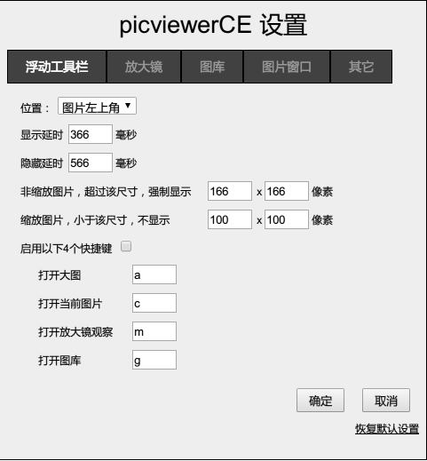
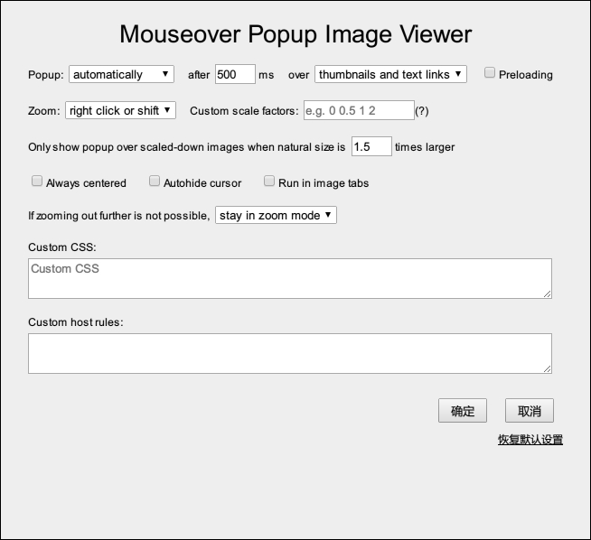

GM_config 设置界面快速搭建辅助库。[sizzlemctwizzle/GM_config](https://github.com/sizzlemctwizzle/GM_config) 修改增强版。

[greasyfork 引用地址](https://greasyfork.org/zh-CN/scripts/6158-gm-config-cn)，[github 源码](https://github.com/ywzhaiqi/GM_config)

## 示例

示例一：[picviewerCE 设置窗口（tab 格式）][example_picviewerCE.html]（[源码][raw_picviewerCE.html]）

示例二：[Mouseover Popup Image Viewer 设置窗口][example_MPIV.html]（[源码][raw_MPIV.html]）

## 修改说明

1. 改成中文 "确定"、"取消" 按钮。
2. select 新增了 textContents 数组。
3. 改成 user.js 后缀，用来上传到 greasyfork
4. 新增了很多特性，详见示例

## 类似

- [eight04/GM_config](https://github.com/eight04/GM_config)

更多见：[Search · GM_config](https://github.com/search?q=GM_config&ref=opensearch)

## 原版说明

For GM_config usage information, read the [wiki](https://github.com/sizzlemctwizzle/GM_config/wiki/).

See what GM_config can do with:

* a server side live example please visit the [demo page](https://sizzlemctwizzle.github.io/GM_config/).
* a client side live example please visit the [GM_config Unit Test](https://openuserjs.org/scripts/sizzle/The_GM_config_Unit_Test), install the user script, and refresh that same page. Check out the [Userscript Beginners HOWTO](https://openuserjs.org/about/Userscript-Beginners-HOWTO) if you are new to user scripts.

[example_picviewerCE.html]: http://rawgit.com/ywzhaiqi/GM_config/master/example/picviewerCE.html
[raw_picviewerCE.html]: https://github.com/ywzhaiqi/GM_config/blob/master/example/picviewerCE.html
[example_MPIV.html]: http://rawgit.com/ywzhaiqi/GM_config/master/example/Mouseover_Popup_Image_Viewer.html
[raw_MPIV.html]: https://github.com/ywzhaiqi/GM_config/blob/master/example/Mouseover_Popup_Image_Viewer.html